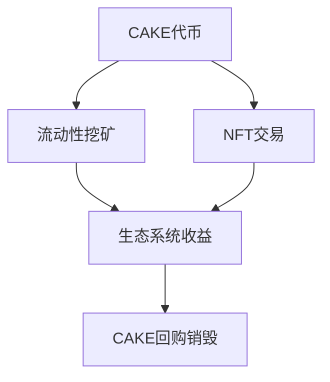
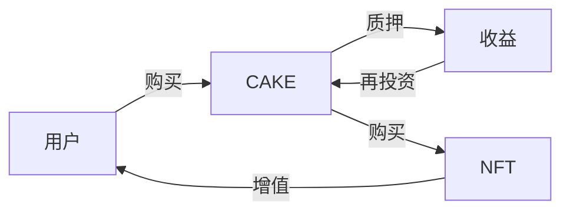

# PancakeSwap生态系统关系解析

## 1. 核心代币 (CAKE)

### CAKE代币特点
- 基于BEP20标准实现
- 是PancakeSwap生态系统的治理代币
- 主要用途：
  - 质押挖矿(Staking)
  - 参与IFO(Initial Farm Offering)
  - 治理投票
  - NFT交易市场的支付媒介

## 2. NFT系统

### NFT集合类型
1. **Pancake Squad**
   - PancakeSwap的主打NFT系列
   - 使用CAKE代币铸造和交易
   - 提供特殊权益和游戏功能

2. **Profile NFTs**
   - 用户个人资料NFT
   - 用于平台身份展示
   - 参与特定活动的准入凭证

### NFT与代币的关联
1. **交易关系**
   - NFT可以用CAKE代币购买
   - NFT交易产生的手续费部分会用于回购CAKE

2. **功能关系**
   - 持有特定NFT可以获得额外的CAKE质押收益
   - NFT可以作为Farm和Pool的加速器

## 3. 网络基础设施

### 主要网络支持
1. **币安智能链(BSC)**
   - PancakeSwap的主要运行网络
   - 提供低成本、高效率的交易环境
   - 支持BEP20代币标准

2. **跨链桥接**
   - 支持与其他公链的资产互通
   - 实现代币和NFT的跨链操作

### 网络与代币的关系
1. **智能合约部署**
   - CAKE代币合约部署在BSC上
   - NFT合约同样部署在BSC上
   - 所有交易都需要支付BNB作为gas费

2. **网络生态整合**
   - 与BSC生态其他项目的互操作性
   - 利用BSC网络的高性能实现快速交易

## 4. 三者协同机制

### 经济模型

### 功能协同
1. **交易生态**
   - 代币提供流动性
   - NFT增加用户粘性
   - 网络保证交易效率

2. **激励机制**
   - 质押CAKE获得NFT铸造权
   - 持有NFT提升收益
   - 网络费用补贴生态发展

## 5. 实际应用场景

### 用户参与流程
1. **初始进入**
   - 连接BSC钱包
   - 获取CAKE代币
   - 创建NFT个人档案

2. **深度参与**
   - 质押CAKE参与流动性挖矿
   - 收集和交易NFT
   - 参与生态系统治理

### 价值循环

## 6. 发展趋势

### 生态扩展
1. **GameFi整合**
   - NFT游戏化应用
   - 代币游戏激励
   - 跨链游戏生态

2. **DeFi创新**
   - NFT抵押借贷
   - 代币流动性创新
   - 多链部署策略

## 总结

PancakeSwap通过巧妙地设计代币(CAKE)、NFT和底层网络(BSC)三者的关系，构建了一个完整的DeFi生态系统：

- **代币(CAKE)** 作为核心价值媒介
- **NFT** 提供独特价值和用户权益
- **网络(BSC)** 提供基础设施支持

这三者相互支撑、相互促进，形成了一个自循环的生态系统，推动整个平台的持续发展和创新。用户可以通过不同的方式参与其中，获得多样化的收益和体验。
