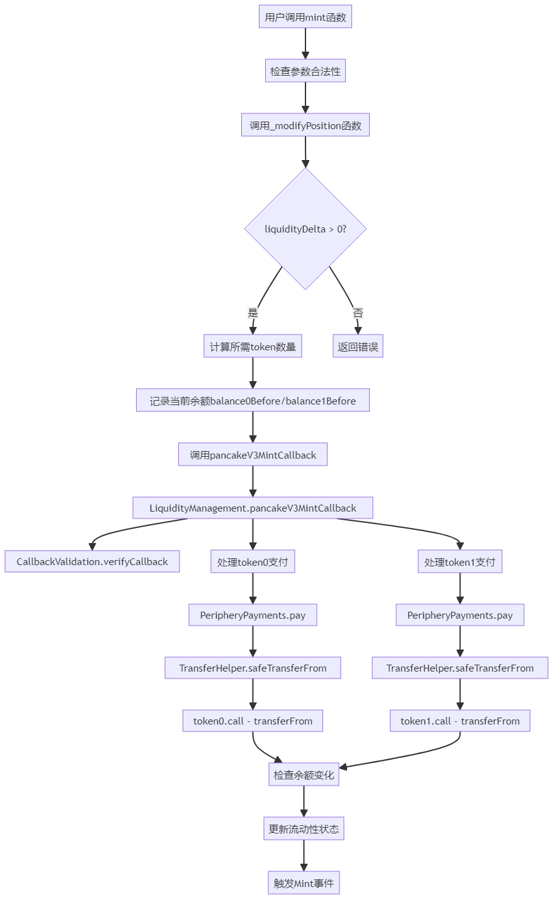

# 添加流动性核心函数mint-详细的mint函数流程图，并解释相关函数之间的交互关系。




## 函数交互关系详解

### 1. mint 函数 (PancakeV3Pool)
```solidity
function mint(
    address recipient,
    int24 tickLower,
    int24 tickUpper,
    uint128 amount,
    bytes calldata data
) external returns (uint256 amount0, uint256 amount1)
```
- 入口函数，负责初始化流动性添加过程
- 调用_modifyPosition计算所需token数量
- 记录添加流动性前的余额
- 调用回调函数完成token转账
- 验证转账结果
- 触发Mint事件

### 2. _modifyPosition 函数
```solidity
function _modifyPosition(ModifyPositionParams memory params)
    private
    returns (
        Position.Info storage position,
        int256 amount0,
        int256 amount1
    )
```
- 核心计算函数
- 验证tick范围的合法性
- 更新position状态
- 计算所需token数量
- 更新流动性状态

### 3. balance0/balance1 函数
```solidity
function balance0() private view returns (uint256)
function balance1() private view returns (uint256)
```
- 获取合约当前token余额
- 使用staticcall安全调用
- 用于验证转账是否成功

### 4. pancakeV3MintCallback 函数 (LiquidityManagement)
```solidity
function pancakeV3MintCallback(
    uint256 amount0Owed,
    uint256 amount1Owed,
    bytes calldata data
) external
```
- 回调函数，处理实际的token转账
- 解码回调数据
- 验证回调来源的合法性
- 调用pay函数执行转账

### 5. pay 函数 (PeripheryPayments)
```solidity
function pay(
    address token,
    address payer,
    address recipient,
    uint256 value
)
```
- 执行具体的token转账逻辑
- 调用TransferHelper进行安全转账
- 处理转账失败的情况

### 6. call 函数调用 (TransferHelper)
```solidity
(bool success, bytes memory data) = token.call(
    abi.encodeWithSelector(IERC20.transferFrom.selector, from, to, value)
);
```
- 最底层的token转账实现
- 使用低级call调用
- 处理返回值确保转账成功

## 函数调用流程

1. 用户调用mint函数
2. mint函数通过_modifyPosition计算所需token数量
3. 记录当前合约token余额
4. 调用pancakeV3MintCallback进行回调
5. 回调函数验证调用者身份
6. 通过pay函数执行token转账
7. TransferHelper使用call执行实际转账
8. 验证转账后的余额变化
9. 更新流动性状态并触发事件

## 安全机制

1. 重入锁保护
2. 回调验证
3. 余额检查
4. 安全的转账实现
5. 错误处理和回滚

## 关键点

1. 模块化设计，职责分明
2. 多层安全验证
3. 高效的状态更新
4. 完善的事件记录
5. 气体优化考虑

这个流程展示了PancakeSwap V3如何安全且高效地管理流动性添加过程，通过多层验证和回调机制确保操作的安全性和原子性。
