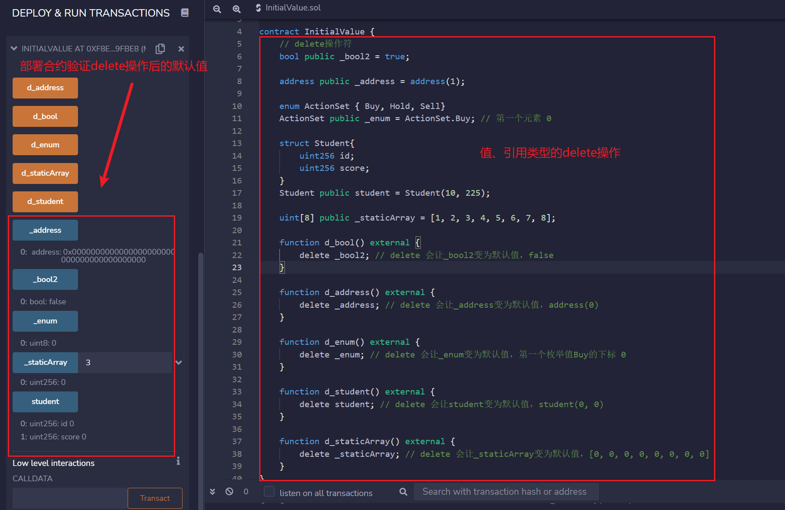

#  Solidity基础入门: 8. 变量初始值

我最近在重新学 Solidity，巩固一下细节，也写一个“ Solidity基础入门”，供学员们使用，每周更新 1-3 讲。


---

## 变量初始值

在`Solidity`中，声明但没赋值的变量都有它的初始值或默认值。这一讲，我们将介绍常用变量的初始值。

### 值类型初始值

- `boolean`: `false`
- `string`: `""`
- `int`: `0`
- `uint`: `0`
- `enum`: 枚举中的第一个元素
- `address`: `0x0000000000000000000000000000000000000000` (或 `address(0)`)
- `function`
  - `internal`: 空白函数
  - `external`: 空白函数

可以用`public`变量的`getter`函数验证上面写的初始值是否正确：

```solidity
bool public _bool; // false
string public _string; // ""
int public _int; // 0
uint public _uint; // 0
address public _address; // 0x0000000000000000000000000000000000000000

enum ActionSet { Buy, Hold, Sell}
ActionSet public _enum; // 第1个内容Buy的索引0

function fi() internal{} // internal空白函数
function fe() external{} // external空白函数 
```

### 引用类型初始值

- 映射`mapping`: 所有元素都为其默认值的`mapping`
- 结构体`struct`: 所有成员设为其默认值的结构体
- 数组`array`
  - 动态数组: `[]`
  - 静态数组（定长）: 所有成员设为其默认值的静态数组

可以用`public`变量的`getter`函数验证上面写的初始值是否正确：

```solidity
// Reference Types
uint[8] public _staticArray; // 所有成员设为其默认值的静态数组[0,0,0,0,0,0,0,0]
uint[] public _dynamicArray; // `[]`
mapping(uint => address) public _mapping; // 所有元素都为其默认值的mapping
// 所有成员设为其默认值的结构体 0, 0
struct Student{
    uint256 id;
    uint256 score; 
}
Student public student;
```

### `delete`操作符

`delete a`会让变量`a`的值变为初始值。

```solidity
// delete操作符
bool public _bool2 = true; 
function d() external {
    delete _bool2; // delete 会让_bool2变为默认值，false
}
```

## 在remix上验证

- 部署合约查看值类型、引用类型的初始值

    

- 值类型、引用类型`delete`操作后的默认值

    

## 总结

这一讲，我们介绍了`Solidity`中变量的初始值。变量被声明但没有赋值的时候，它的值默认为初始值。不同类型的变量初始值不同，`delete`操作符可以删除一个变量的值并代替为初始值。
