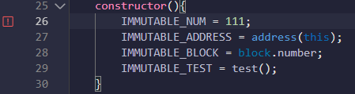

#  Solidity基础入门: 9. 常数 constant和immutable

我最近在重新学 Solidity，巩固一下细节，也写一个“ Solidity基础入门”，供学员们使用，每周更新 1-3 讲。

---
这一讲，我们介绍Solidity中和常量相关的两个关键字，`constant`（常量）和`immutable`（不变量）。状态变量声明这两个关键字之后，不能在初始化后更改数值。这样做的好处是提升合约的安全性并节省`gas`。

另外，只有数值变量可以声明`constant`和`immutable`；`string`和`bytes`可以声明为`constant`，但不能为`immutable`。

## constant和immutable

### constant

`constant`变量必须在声明的时候初始化，之后再也不能改变。尝试改变的话，编译不通过。

``` solidity
// constant变量必须在声明的时候初始化，之后不能改变
uint256 constant CONSTANT_NUM = 10;
string constant CONSTANT_STRING = "0xAA";
bytes constant CONSTANT_BYTES = "";
address constant CONSTANT_ADDRESS = 0x0000000000000000000000000000000000000000;
```

### immutable

`immutable`变量可以在声明时或构造函数中初始化，因此更加灵活。在`Solidity v0.8.21`以后，`immutable`变量不需要显式初始化，未显式初始化的`immutable`变量将使用数值类型的初始值（见 [8. 变量初始值]()）。反之，则需要显式初始化。
若`immutable`变量既在声明时初始化，又在constructor中初始化，会使用constructor初始化的值。

``` solidity
// immutable变量可以在constructor里初始化，之后不能改变
uint256 public immutable IMMUTABLE_NUM = 9999999999;
// 在`Solidity v8.0.21`以后,下列变量数值暂为初始值
address public immutable IMMUTABLE_ADDRESS; 
uint256 public immutable IMMUTABLE_BLOCK;
uint256 public immutable IMMUTABLE_TEST;
```

你可以使用全局变量例如`address(this)`，`block.number` 或者自定义的函数给`immutable`变量初始化。在下面这个例子，我们利用了`test()`函数给`IMMUTABLE_TEST`初始化为`9`：

``` solidity
// 利用constructor初始化immutable变量，因此可以利用
constructor(){
    IMMUTABLE_ADDRESS = address(this);
    IMMUTABLE_NUM = 1118;
    IMMUTABLE_TEST = test();
}

function test() public pure returns(uint256){
    uint256 what = 9;
    return(what);
}
```

## 在remix上验证

1. 部署好合约之后，通过remix上的`getter`函数，能获取到`constant`和`immutable`变量初始化好的值。

   

2. `constant`变量初始化之后，尝试改变它的值，会编译不通过并抛出`TypeError: Cannot assign to a constant variable.`的错误。

   

3. `immutable`变量初始化之后，尝试改变它的值，会编译不通过并抛出`TypeError: Immutable state variable already initialized.`的错误。

   

## 总结

这一讲，我们介绍了Solidity中两个关键字，`constant`（常量）和`immutable`（不变量），让不应该变的变量保持不变。这样的做法能在节省`gas`的同时提升合约的安全性。
